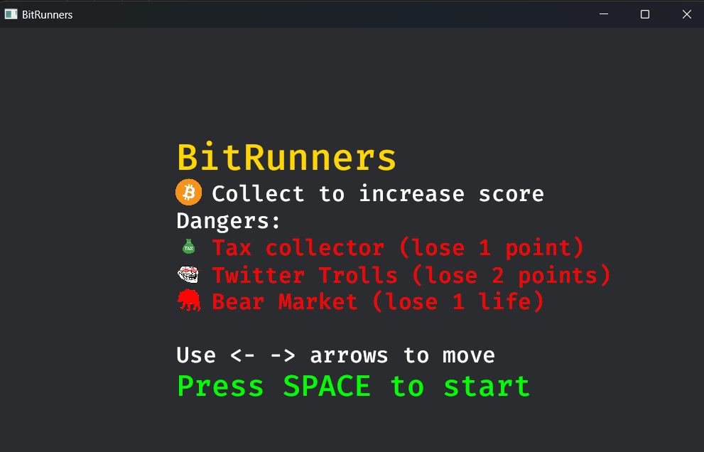
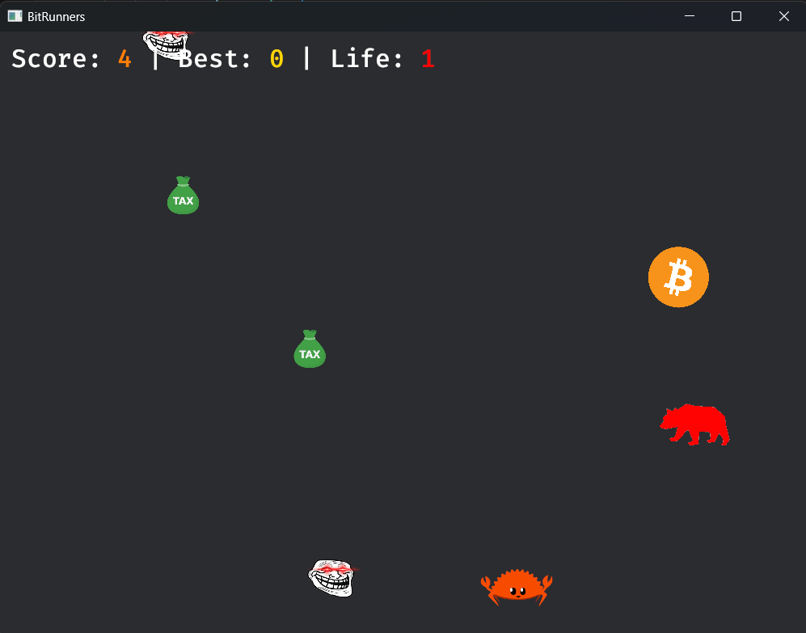
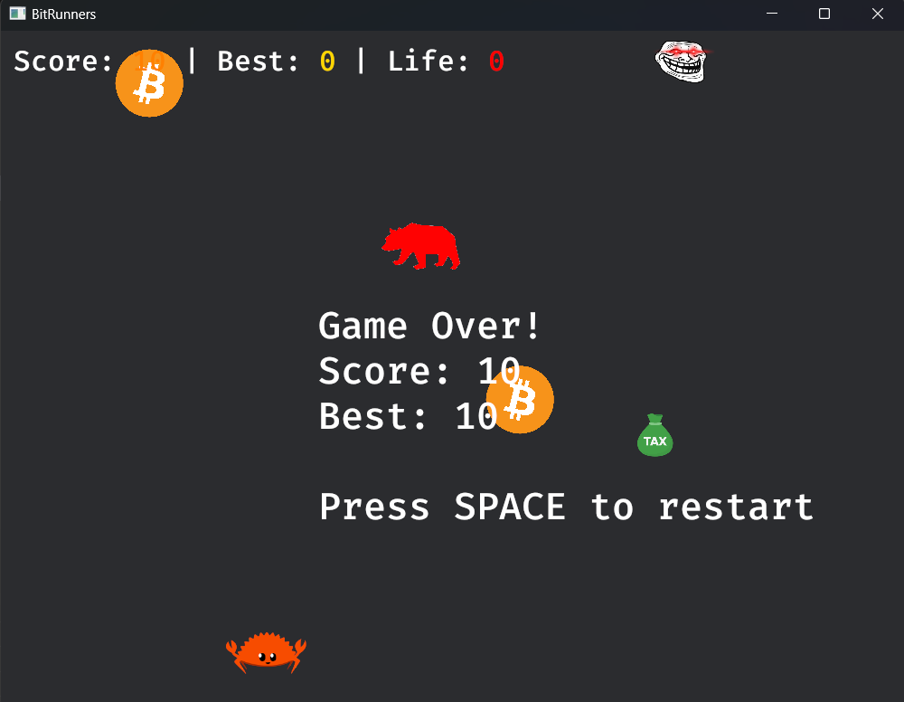

 # BitRunners

A fast-paced arcade game built with Rust and Bevy where you navigate through the crypto market, collecting bitcoins while avoiding market hazards.

 ## 🎮 Gameplay

Navigate your player through the crypto market:
- Collect bitcoins to increase your score
- Avoid obstacles:
  - Tax collectors (-1 point)
  - Twitter Trolls (-2 points)
  - Bear Market (lose a life) - Only one life - make it count!
  - Score increases difficulty progressively
## 🎮 Screenshot
 
 
 
 
 
 ## 🕹️ Controls
 
 - `←` `→` Arrow keys to move
 - `SPACE` to start game
 - `SPACE` to restart after game over
 
 ## 🛠️ Technical Structure
 
 ```
 src/
 ├── main.rs           # Game initialization
 ├── game.rs           # Game states and plugin setup
 ├── components.rs     # Game components and resources
 └── systems/
     ├── mod.rs        # Systems module
     ├── setup.rs      # Game setup and assets
     ├── menu.rs       # Menu system
     ├── player.rs     # Player movement and collision
     ├── bitcoin.rs    # Bitcoin spawning and collection
     ├── obstacle.rs   # Obstacle spawning and movement
     └── game_over.rs  # Game over handling
 ```
 
 ## 🚀 Running the Game
 
 1. Requirements:
    - Rust and Cargo installed
    - Required assets in `assets/` folder
 
 2. Run:
 ```
 cargo run
 ```
 
 ## 🎨 Assets Required
 
 Place these images in `assets/` folder:
 - `player.png`
 - `bitcoin.png`
 - `tax.png`
 - `troll.png`
 - `bear.png`
 
 ## 🔧 Built With
 
 - [Rust](https://www.rust-lang.org/) - Programming language
 - [Bevy](https://bevyengine.org/) - Game engine
 - [rand](https://crates.io/crates/rand) - RNG
